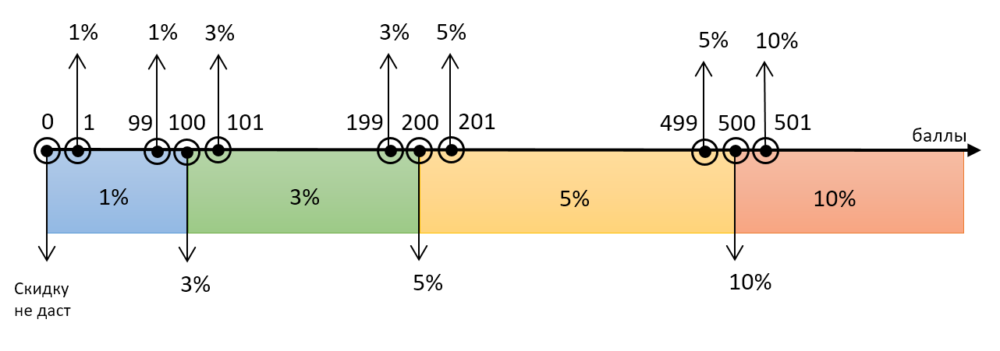

# Тестовое задание №1. Составить тестовые данные для автомата.
## Данные, которые необходимо уточнить:

1. По верхней или нижней границе брать значения;
2. Выдает ли автомат скидку при значении 0;
3. Если на п.2 ответ положительный, то может ли автомат выдавать скидку без использовании карты;
4. Какое максимальное число баллов принимает автомат;
5. Могут ли баллы быть не целым (дробным) числом;
6. Зависит ли скидка от цены продукта, на который предоставляется скидка.

## Для выполнения задания я принимаю:
1. Баллы могут быть только целым числом;
2. Автомат не выдает скидку за 0 баллов, то есть скидку 1% можно получить только при наличии карты и хотя бы 1 балла на ней;
3. Значения принимаю по нижней границе;
4. Скидка не зависит от цены продукта;
5. Стоймость продукта.

**Исходя из известных и принятых данных для теста автомата, для наглядности, составлю диаграмму.**

|Начальная Цена|Количество баллов|Ожидаемая скидка|Итоговая цена|
|-|-|-|-|
|1000|0|-|1000|
|1000|1|10(1%)|990|
|1000|99|10(1%)|990|
|1000|100|30(3%)|970|
|1000|101|30(3%)|970|
|1000|199|30(3%)|970|
|1000|200|50(5%)|950|
|1000|201|50(5%)|950|
|1000|499|50(5%)|950|
|1000|500|100(10%)|900|
|1000|501|100(10%)|900|
